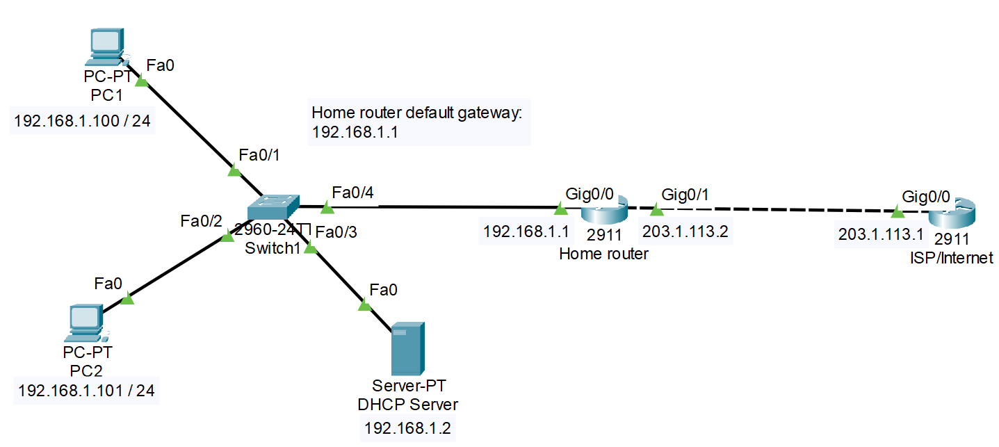
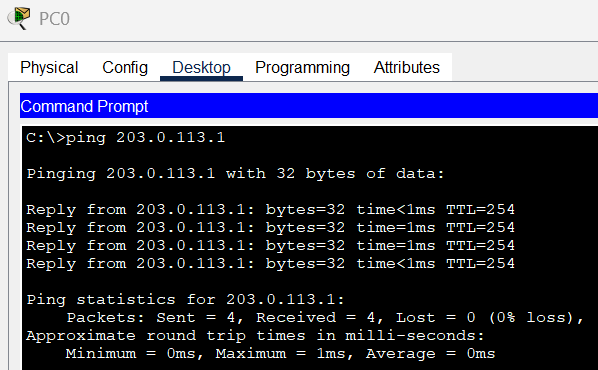
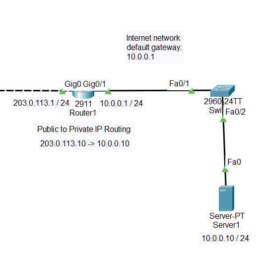

## NAT AND INTERNET ACCESS 

**Step 5: Simulate Internet Access Using a Router**  
Add another router to the topology that connects to the "home" network
- Set the IP addresses of the new port connections
  - Home router Gig 0/1: 203.0.113.2 / 24
  - ISP/Internet Gig 0/0: 203.0.113.1 / 24
  
  
*Simulate internet access*

**Step 6: Configure a NAT**  
Configure NAT for the home router using CLI
- Configure Gig 0/0 interface:
  - enable (en)
  - configure terminal (conf t)
  - interface Gig 0/0 (in gig 0/0)
  - ip nat inside (LAN)
  - end

- Configure Gig 0/1 interface:
  - enable (en)
  - configure terminal (conf t)
  - interface Gig 0/0 (in gig 0/0)
  - ip nat outside (WAN)
  - end

- Create an access-list to match the internal IP range  
(this allows packets sent out to also find a way back in to their correct destination within the home network)
  - access-list 1 permit 192.168.1.0  0.0.0.255  
(any device in the 192.168.1.0 / 24 range can be NAT’d)

- Apply a NAT overload
*(this allows multiple private IP addresses on a local network to share a single public IP address)*
  - enable (en)
  - configure terminal (conf t)
  - ip nat inside source list 1 interface gigabitEthernet 0/1 overload
  - end
- Test with a ping to 203.0.113.1 from a PC to confirm it worked  

  
*Tested ping to make sure NAT is functional*

**Step 7: Simulate a Public Web Server**  
Add a switch and a server to the Internet-side network 
- Configure internet router Gig 0/1 interface:
  - 10.0.0.1 / 24
  - ip nat inside (LAN)
- Configure internet router Gig 0/0 interface:
  - ip nat outside (WAN)
- Configure the IP address of the server:
  - 10.0.0.10 / 24
  - default gateway: 10.0.0.1
- Configure the internet router:
  -  ip nat inside source static 10.0.0.10 203.0.113.10  
    (routes traffic for public IP to private IP)  
- Test if PC can ping the server's public IP 203.0.113.10  

  
*Set a public to private IP routing*
