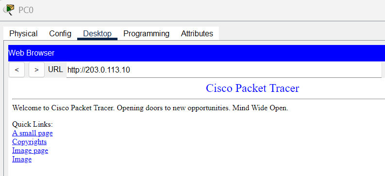

## Enable Web Service and Permit DNS

**Step 8: Enable Web Service on the Internet-side Server**  
Go to services on the server and enable HTTP.
- Make sure it is turned on 

**Step 9: Test the Connection to the Web Browser**  
Go to a PC on the Home-side network.  
- Open a web browser and try to access the web browser IP: 203.0.113.10
- Can also ping

  
*Test PC connection to web server*

**Step 10: Add as Man Web Servers as Needed**  
Repeat steps 7 to 9 to add another server and test its connection. 

  
*Add more servers to access more browsers*

**Step 11: Add DNS services to the Home LAN**  
Select the home server and enable DNS services 
- Add a website name and the public IP address to the record  
  This links the web public IP with a domain name
- Make sure DNS is turned on
- Go back to the DHCP configuration for homePool and set DNS IP to the server's IP: 192.168.1.2
  This will now auto-assign IP addresses and DNS services for all computers within the pool
- Restart the computers or turn off and turn on DHCP to get DNS services enabld
- Test the connection through web browser or ping

  
*Domain name resolution instead of IP address*

  
*Assigns the IP to the domain name*
