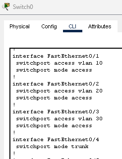
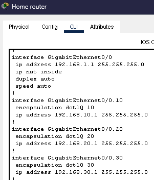

## Create VLANs to Better Organize Local Devices and Permissions

**Step 12: Create and Configure VLANs**  
Determine VLAN and port assignment we want/need for our setup

    |   VLAN    |    Name   | Switch Port # |
    | --------- | --------- | ------------- |
    |    10     |   Admin   |     Fa 0/1    |
    |    20     |   Users   |     Fa 0/2    |
    |    30     |  Servers  |     Fa 0/3    |

- Configure the switch in Command Line Interface(CLI) and create the 3 VLANs
  - conf t -> vlan 10 -> name Admin
  - conf t -> vlan 20 -> name Users
  - conf t -> vlan 30 -> name Servers

Assign the connected ports to the created VLANs  
- Admin
  - in range Fa 0/1 (range of included ports)
  - switchport mode access (allows access to trunking)
  - switchport access vlan 10 (assign access to specific vlan)
- Users
  - in range Fa 0/2 
  - switchport mode access 
  - switchport access vlan 20 
- Servers
  - in range Fa 0/3 
  - switchport mode access 
  - switchport access vlan 30
- Can check assignment with CLI command "show run"

**Step 13: Enable a Trunk**  
Enable a trunk to and from the router which will allow mutiple VLANs to communicate to the router using the same port.  
- Assign the port connected to the router as a trunk
  -  in Fa 0/4
  -  switchport mode trunk
-  Check and confirm VLAN assignments and trunk
  - show vlan brief

  
*Show successful VLAN and trunk creation*

**Step 14: Configure Router Sub-interfaces for Inter-VLAN routing**  
This is needed so that devices within one VLAN are able to communicate with a device in another VLAN.

- Go to the CLI of the home router to configure sub-interfaces with VLAN IDs
- Admin
    - in g 0/0.10
    - encap dot1Q 10
    - ip address 192.168.10.1 255.255.255.0
    - exit
- Users
    - in g 0/0.20
    - encap dot1Q 20
    - ip address 192.168.20.1 255.255.255.0
    - exit
- Servers
    - in g 0/0.30
    - encap dot1Q 30
    - ip address 192.168.30.1 255.255.255.0
    - exit
- Can check if it was created with "show run"

  
*Show sub-interface creation*

