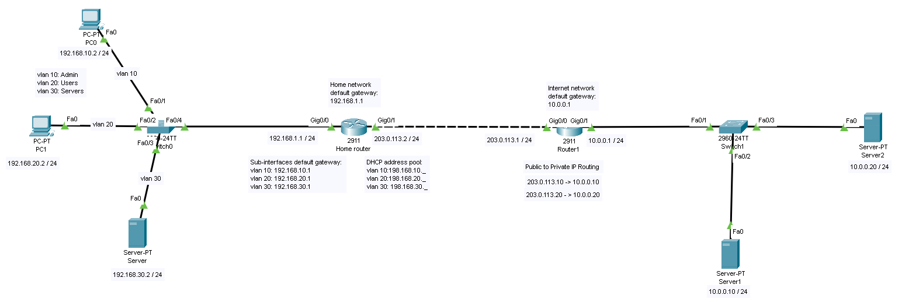

## Reconfigure DHCP and NAT for VLANs and Inter-VLAN Routing  

**Step 15: Re-configure DHCP pools for VLANs**  
The DHCP server will no longer work since we created sub-interfaces and it will conflicty with the address assignment.  
To still have DHCP with the new sub-interfaces, we need to initialize DHCP for all of the sub-interfaces.  
This will help to still automatically assign addresses using DHCP within the different VLANs. 

- Diable the DHCP service
- Configure the router
  - conf t  
- Create DHCP pools for the VLANs:
- Admin
  - ip dhcp pool VLAN10
  - network 192.168.10.0 255.255.255.0
  - default-router 192.168.10.1
  - dns-server 192.168.30.2 (use for now, we will set later)
- Users
  - ip dhcp pool VLAN20
  - network 192.168.20.0 255.255.255.0
  - default-router 192.168.20.1
  - dns-server 192.168.30.2
- Servers
  - ip dhcp pool VLAN30
  - network 192.168.30.0 255.255.255.0
  - default-router 192.168.30.1
  - dns-server 192.168.30.2
 
- Need to re-configure each PC so they get a new DHCP assignment from our new pool

  
*Show the new DHCP assignment*

- Also re-assign the IP address and default gateway of the servers
- DNS:
  - ip address: 192.168.30.2
  - default gateway: 192.168.30.1
- Test the inter-VLAN routing by pinging a device on a different VLAN

  
*Test the inter-VLAN routing*

**Step 16: Re-configure the NAT**  
We need to update the inside/outside NAT to account for the new sub-interfaces we made for the VLANs 

- Update the access-list for the home router:
  - access-list 1 permit 192.168.10.0  255.255.255.0
  - access-list 1 permit 192.168.20.0  255.255.255.0
  - access-list 1 permit 192.168.30.0  255.255.255.0
- Apply NAT overload to the outside via Gig 0/1
  - ip nat inside source list 1 interface g0/1 overload
- Inside/outside NAT configuration with the VLAN sub-interfaces
  - in g0/0.10 -> ip nat inside 
  - in g0/0.20 -> ip nat inside 
  - in g0/0.30 -> ip nat inside
  - in g0/1 -> ip nat outside
- Ensure a default route to and from Home router and Internet router
- Home router
  - ip route 0.0.0.0  0.0.0.0  203.0.113.0 (to Internet)
- Internet router
  - ip route 0.0.0.0  0.0.0.0  203.0.113.2 (to Home)
 
## Final Topology

  
*Final Network Topology*
