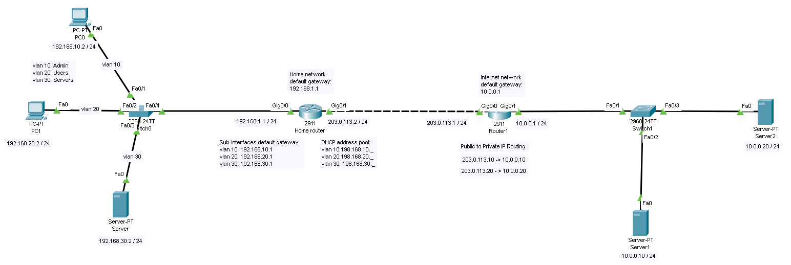

# Virtual Home Lab

This project simlulates a multi-VLAN home netowork using Cisco Packet Tracer. 
It demonstrates inter-VLAN routing, DHCP, DNS, and NAT configurations to replicate real-world networking concepts within a virtual environment and no physical hardware. 

## Overview 
- Designed and implemented a multi-VLAN topology (Admin, Users, Servers).
- Configured inter-VLAN routing, DHCP, DNS, and NAT segmented internal networks with centralized services.
- Tested connectivity and troubleshooting across VLANs to reinforce networking fundamentals.

## Purpose
The goal of this lab was to gain hands-on experience with Cisco networking concepts, practice core configurations, and develop troubleshooting skills in a virtual environment. 

## Outcome 
Successfully built a functional network simulation that mirrors enterprise-style setups, strengthening skills in network design, protocol configuration, and problem-solving.

## Network Topology 
  

## Configuration Highlights 
- **VLANs**: VLAN 10 (Admin), VLAN 20 (Users), VLAN 30 (Servers).
- **Routing**: Inter-VLAN routing with subinterfaces.
- **Services**: DHCP, DNS, and NAT for internet access.

## Testing & Results 
- Verified connectivity between VLANs.  
- Confirmed DNS resolution from client PCs.  

## Lessons Learned
- The importance of testing services (like DNS) when applying security rules.  
- How to troubleshoot connectivity issues in a simulated environment.  

## Tools
- Cisco Packet Tracer  
- GitHub (for documentation)  
